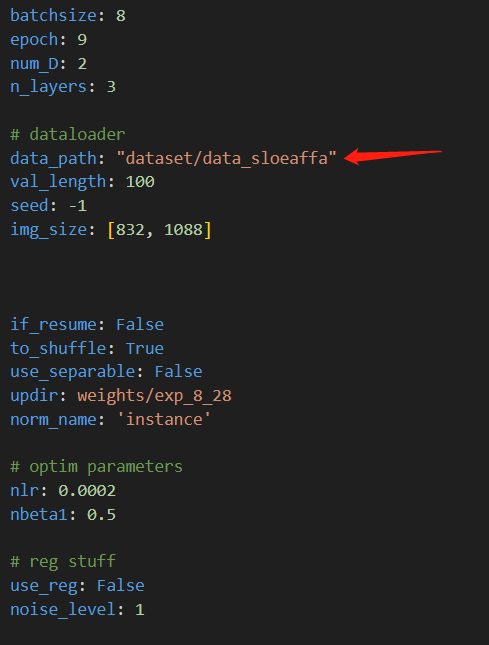

# **UWAFA-GAN**
This code is an enhanced version of the pytorch implementation of the [UWAT-GAN](https://github.com/Tinysqua/UWAT-GAN) and our paper "UWAT-GAN: Ultra-Wide-Angle transformation using Multi-scale Generative Adversarial Nets". It can be used to turning UWF scanning laser ophthalmoscopy(UWF-SLO) to the UWF fluorescein angiography(UWF-FA) and display the tiny vascular lesion areas. It could be trained on a little misalignment paired UWF-SLO and UWF-FA. 

<br><br>

<br><br>

## Generation UWF-FA from UWF-SLO with nice detail 


## Pre-requisties
- Linux
- python>=3.7
- NVIDIA GPU (memory>=10G) + CUDA cuDNN

## How to train
### Preparation of the data
We have proposed a example in the path "dataset/example_pairs", firstly we need to random crop them to the training dataset. 
```
python utils/advan_random_crop.py --datadir dataset/example_pairs  --output_dir dataset/data_sloeaffa --suffix .jpg --index_interval 0 --index_interval 6
```
This will crop the suffix-jpg images from path "dataset/example_pairs" and put the result into the path "dataset/data_sloeaffa". Then the training procedure can be exerted. Find the yaml file in the path "config/train_config.yaml", making sure the **data_path** of it is correct. 

<br><br>

<br><br>

and run the command:
```
python -u train_changed.py
```

## Get start to the evaluation 
### checkpoint configure
Download the [checkpoint](https://drive.google.com/drive/folders/1_Ax2anHkz2CfKJu68UXNNDQ-c7PShIpe?usp=sharing) and make sure the path "./weights/exp_8_17" correct. Directory "exp_8_17" should contains four elements:
```
├── exp_8_17
    ├──config_exp_8_17.yaml
    ├──discriminator.pt
    ├──generator.pt
    ├──reg.pt
``` 

and run the command:
``` bash
function Func1(){
    count=1
    while (($count < 7))
    do python -u utils/Model_evaluation_changed.py --updir dataset/example_pairs --index $count --model_updir 'weights/exp_8_17'
    count=$(($count+1))
    done
}

Func1
```

The result will be saved in the path dataset/example_pairs 